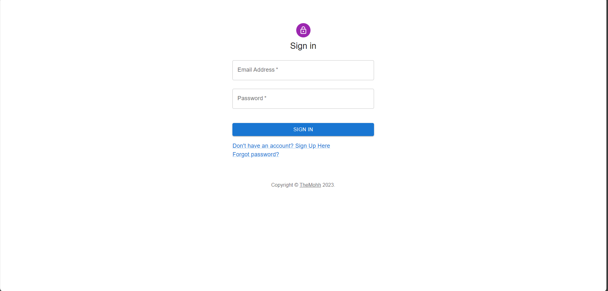
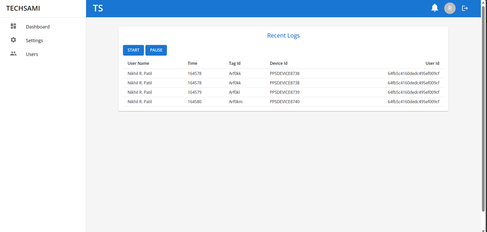
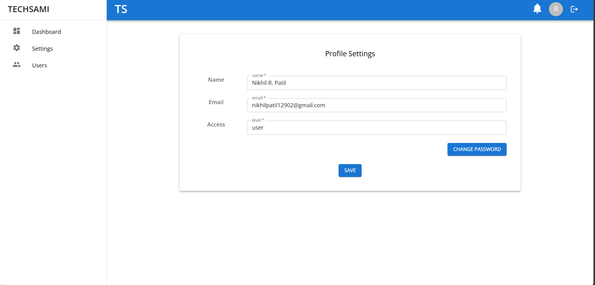
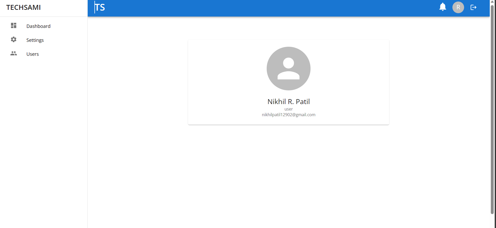
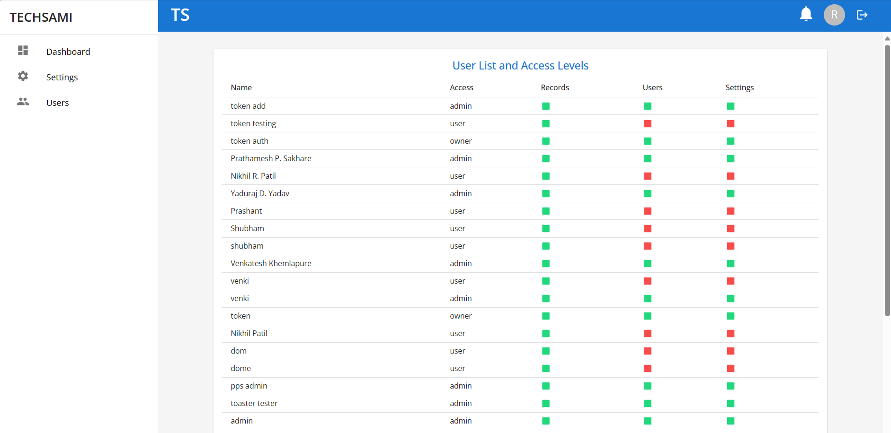

# RFID - IoT Support Application 🚀

Welcome to the IoT Support Application, your trusted partner in harnessing the full potential of IoT-based hardware. This platform seamlessly integrates with your devices, providing a secure, efficient, and visually captivating experience. Whether you're a business owner, data analyst, or IoT enthusiast, our application empowers you to transform raw data into actionable insights with ease.

## Key Features 🌟

### 🌐 IoT Hardware Integration
Connect effortlessly with your IoT-based hardware, ensuring real-time data capture and processing.

### 📊 Interactive Dashboard
Unlock the power of data visualization with our intuitive and visually rich dashboard. Gain valuable insights and analytics at your fingertips.

### 🔒 Granular Access Control
Prioritize security with multiple access levels, ensuring that team members have precisely the right permissions for their roles.

### 🔐 JWT Token Authorization
Secure your application with advanced user authentication and authorization using JSON Web Tokens (JWT).

### 🔑 Password Encryption
Protect sensitive user data with cutting-edge encryption techniques, guaranteeing confidentiality and security.

### 🚀 MERN Stack with Redux
Experience high performance, scalability, and seamless user interactions with the robust MERN stack, enhanced by Redux for state management.

### 📈 Real-Time Data Updates
Stay informed with real-time data updates from your IoT hardware, enabling data-driven decision-making.

### 📱 Responsive Design
Access your IoT data and insights on the go with our responsive design that adapts to various devices and screen sizes.

## Getting Started 🚀

To get started with our IoT Support Application, follow these steps:

1. **Clone the Repository:**
2. **Install Dependencies:**
3. **Start the Application:**
4. **Access the Dashboard:**
Open your web browser and visit [http://localhost:3000](http://localhost:3000).

## Customization 🌈

Tailor the application to your specific needs and evolve your IoT ecosystem with ease. Our flexible platform enables you to add new features and functionalities as your requirements grow.

## Support and Feedback 💬

We value your input! If you have questions, feedback, or suggestions, please don't hesitate to reach out to our support team at [support@iot-app.com](mailto:support@iot-app.com).

## Let's Transform IoT Together! 🌐

Join us in revolutionizing the IoT landscape. Empower your business, explore new possibilities, and make data-driven decisions effortlessly with our IoT Support Application.

**Unlock the Power of Data.** 💡

Happy IoT-ing!

